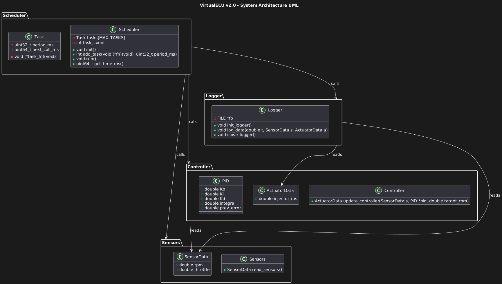

# VirtualECU v2.0

## Description

**VirtualECU v2.0** est un simulateur d’ECU (Engine Control Unit) moteur sous Linux.  
Cette version intègre :  

- Un **scheduler temps réel multi-tâches** (capteurs, contrôleur, logger) inspiré d’un RTOS.  
- Un **modèle moteur dynamique simple** avec RPM qui évolue selon l’actionneur.  
- Un **contrôleur PID** pour réguler le régime moteur.  
- Un **logger CSV** pour enregistrer les données RPM, throttle et injection.  
- Affichage console des RPM et de la commande injecteur en temps réel.  

Le projet est conçu pour servir de base à la simulation moteur, à l’apprentissage des systèmes embarqués et à l’intégration dans des architectures ROS ou CAN simulées.

---

## System Architecture

The UML diagram below shows the modular architecture of **VirtualECU v2.0**, including the Scheduler, Sensors, Controller, and Logger modules:




---

## Compilation

```bash
make CC= ARCH 

if native 
./ecu_sim 

if CROSS COMPILER ARM ARCH 
qemu_run ./EXE
